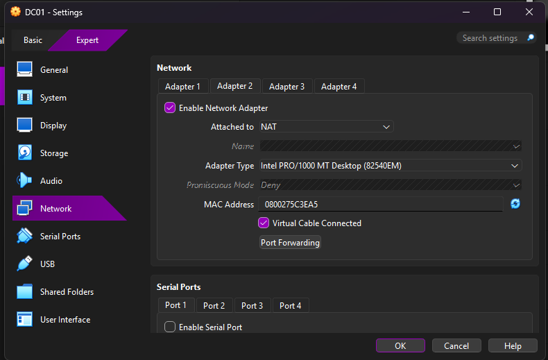

# Create the DC01 Virtual Machine

## Objective

Create the Windows Server virtual machine that will become the domain controller for the lab.

## VM Configuration

- VM name: DC01
- Hypervisor: Oracle VirtualBox
- Memory: 4 GB
- Virtual CPUs: 2
- Virtual disk: 60 GB dynamically allocated
- Adapter 1: Internal Network named LABNET
- Adapter 2: NAT

## Why This Configuration Was Chosen

The internal network allows the lab machines to communicate in an isolated environment. The NAT adapter gives the server internet access without placing the domain controller directly on the physical home network.

## Verification

- [x] DC01 appears in VirtualBox
- [x] Server ISO is attached
- [x] Adapter 1 is connected to LABNET
- [x] Adapter 2 is connected to NAT

## Screenshots

### Adapter 1 — Internal Network

### Adapter 2 — NAT

