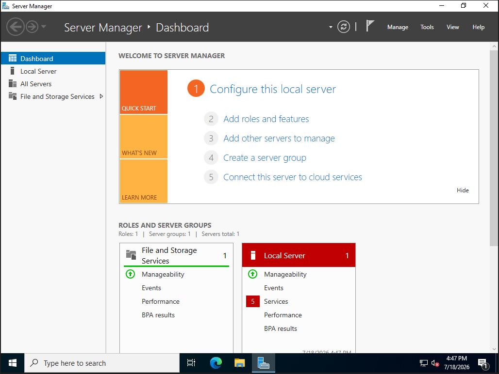

# Install Windows Server

## Objective

Install Windows Server 2022 Standard Evaluation with Desktop Experience on the DC01 virtual machine.

## Installation Media

- ISO: SERVER_EVAL_x64FRE_en-us
- Edition: Windows Server 2022 Standard Evaluation
- Installation type: Desktop Experience
- Virtual disk: 60 GB

## Installation Steps

1. Started the DC01 virtual machine.
2. Booted from the Windows Server ISO.
3. Selected the language, time, and keyboard settings.
4. Clicked **Install now**.
5. Selected **Windows Server 2022 Standard Evaluation (Desktop Experience)**.
6. Accepted the license terms.
7. Selected **Custom: Install Microsoft Server Operating System only**.
8. Selected the 60 GB unallocated virtual disk.
9. Allowed Windows Server to install and restart.
10. Created a password for the local Administrator account.
11. Logged in and verified that Server Manager opened.

## Verification

- [x] Windows Server installed successfully
- [x] Desktop Experience is available
- [x] Local Administrator account works
- [x] Server Manager opens
- [x] DC01 boots without the installation process restarting

## Screenshot

## Problems Encountered

None yet.

## What I Learned

Windows Server can be installed with either a graphical interface or Server Core. Desktop Experience was selected because it provides the full graphical interface, which is better suited for learning the administrative tools.