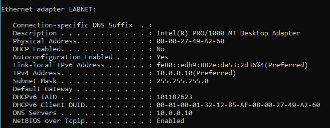

# Configure DC01 Networking

## Objective
Configure DC01's name and network adapters in preparation for installing Active Directory, DNS, and DHCP.

## Server Name
DC01

## Network Adapter Configuration
IP address:       10.0.0.10
Subnet mask:      255.255.255.0
Default gateway:  [BLANK]
DNS server:       10.0.0.10

## Why I Configured It This Way
I renamed the server DC01 because it will eventually become the first domain controller in the lab. Giving servers descriptive names makes them easier to identify and manage.

I renamed the network adapters LABNET and NAT so that I can easily tell which connection serves the internal lab network and which provides DC01 with outside network access.

I gave DC01 a static IP address because clients and network services need to be able to reliably find the server. If its address changed frequently through DHCP, this could cause problems for services that depend on DC01.

I used the 10.0.0.0/24 network for LABNET. DC01 was assigned 10.0.0.10, leaving other addresses available for additional devices and services in the lab.

LABNET does not currently have a default gateway because there is no router connecting LABNET to another network.

DC01's DNS server is set to 10.0.0.10 because DNS will eventually run on DC01 itself.

The NAT adapter was left on DHCP because VirtualBox automatically provides the network configuration that DC01 needs for outside connectivity.

## Verification
Ran `ipconfig /all` and verified:

- LABNET has the static IP address 10.0.0.10
- Subnet mask is 255.255.255.0
- LABNET has no default gateway
- DNS server is set to 10.0.0.10
- DHCP is disabled on LABNET
- NAT is still configured to receive its network settings automatically through DHCP

## Problems Encountered
At first, I wasn't sure which Windows network adapter was LABNET and which adapter was NAT. I verified the adapters before configuring them and then renamed them LABNET and NAT to make them easier to identify.

## What I Learned
I have a better understanding of why a static IP is necessary for a server. I learned how to choose an IP when designing a network from scratch and why 10.0.0.10 was chosen for DC01. I can now explain the difference between a default gateway and a DNS server. I definitely still need practice with IP addressing and subnetting before I would be comfortable configuring this on my own, though.

## Screenshot

