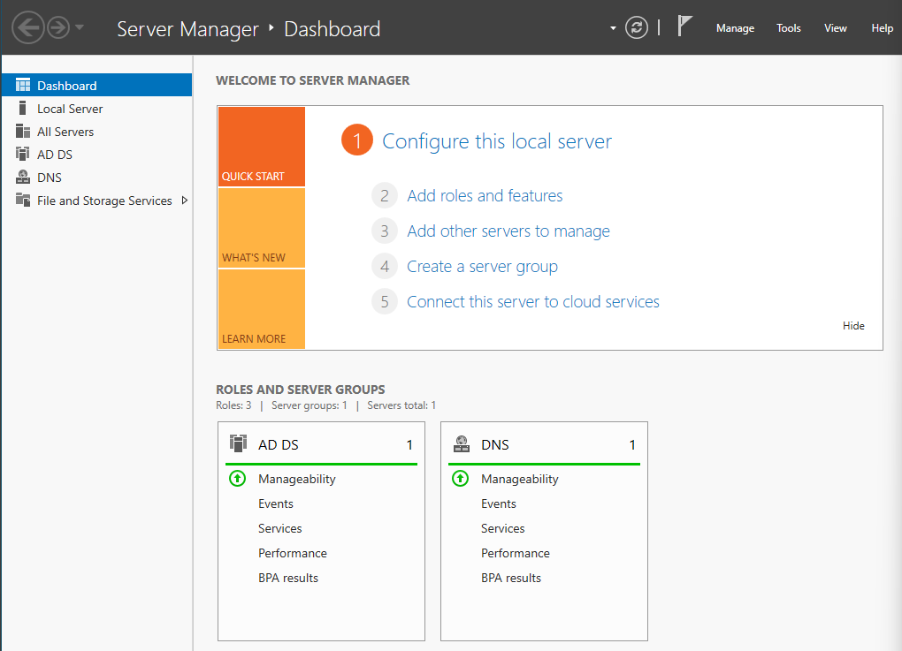
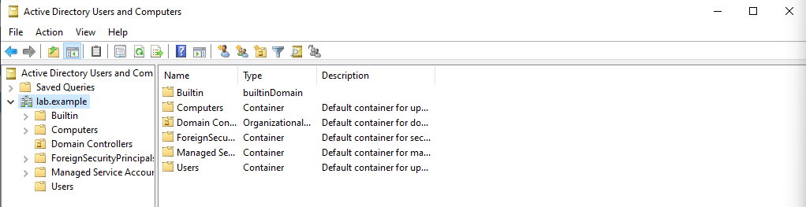
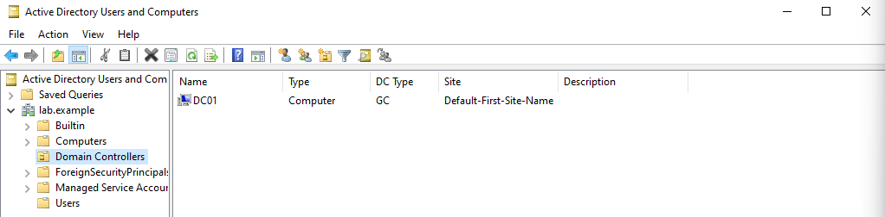

# Install Active Directory Domain Services

## Objective

Install Active Directory Domain Services

## Installation and Configuration

The installation was pretty straightforward. I used Server Manager and followed the wizard. I also installed the required features that Windows selected.

- Created a new Active Directory forest with the root domain `lab.example`
- I chose `lab.example` to avoid accidentally choosing somebody's real public domain
- NetBIOS domain name was automatically set to `LAB`
- Promoted DC01 to a domain controller for `lab.example`
- Enabled DNS Server and Global Catalog
- Read Only Domain Controller (RODC) was left disabled
- Created and saved a separate DSRM password for Active Directory recovery
- Remaining settings were left at their defaults

## Verification

After DC01 restarted, I verified that:

- I could log in using the `LAB\Administrator` domain account
- AD DS and DNS appeared in Server Manager without errors
- `lab.example` appeared in Active Directory Users and Computers
- DC01 appeared in the Domain Controllers container
- The default Active Directory users and groups were created

## Problems Encountered

None

## What I Learned

I learned that a forest is the top-level structure in Active Directory and can contain one or more domains.

My current lab is structured like this, with DC01 providing the listed services:

```text
Forest: lab.example
│
└── Domain: lab.example
    │
    └── DC01
        ├── Domain Controller
        ├── Active Directory
        ├── DNS Server
        └── Global Catalog
```

I learned the difference between a domain and a domain controller. A domain is not a physical machine. It's an environment containing users, computers, groups, and other resources. A domain controller is the actual server that provides Active Directory services for that domain.

I also learned that CLIENT01 and CLIENT02 represent computers, not individual users. Multiple domain users can potentially log into the same domain-joined computer using their own accounts and receive their own permissions and settings.

I learned that the `krbtgt` account in Active Directory is a built-in account used by Kerberos. Kerberos is an authentication protocol used by Active Directory domains.

I learned about the different security group scopes:

- Global groups are commonly used to organize users based on their role or function, such as putting Dave into an Accounting group.
- Domain Local groups are commonly used when assigning access to resources, such as an `Accounting-Share-RW` group that provides read/write access to an Accounting share.
- Universal groups can contain accounts/groups from multiple domains and can be used across the forest.

## Screenshots





