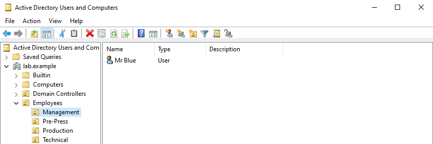
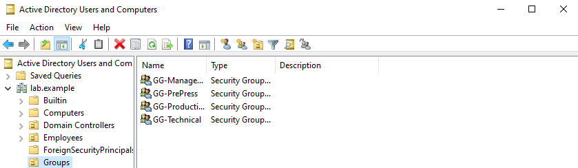

# Configure Active Directory Structure

## Objective
Configure the basic Active Directory structure by creating OUs, domain users, and Security Groups.

## Configuration
- Created four top-level Organizational Units (OUs):
  - Employees
  - Workstations
  - Servers
  - Groups
- Created four additional OUs inside the `Employees` OU to represent different departments:
  - Management
  - Technical
  - Pre-Press
  - Production
- Created one domain user inside each department OU
- Created four groups inside the `Groups` OU that correspond with the four department OUs
- Added each employee to their corresponding department group

## Verification
- [x] Employees, Workstations, Servers, and Groups OUs were created
- [x] Management, Technical, Pre-Press, and Production OUs appear under Employees
- [x] Each department OU contains its assigned user
- [x] GG-Management, GG-Technical, GG-PrePress, and GG-Production were created as Global Security groups
- [x] Each user is a member of their corresponding department group

## Problems Encountered
When first creating the organizational units in lab.example, I accidentally added one OU inside of another. Since I left the default setting, "protect container from accidental deletion", I had to enable Advanced Features, find the misplaced OU, go into the properties, and uncheck that setting in order to delete the OU and recreate it in the correct location.

## What I Learned
Before today I didn't know exactly what an Organizational Unit (OU) is. An OU is a container created inside Active Directory that is used to organize and manage things like users and computers.

OUs can also be helpful when applying group policies.

I also had a brief moment where I wasn't really sure how OUs and Security Groups differed. OUs are different from Security Groups because an OU describes where the account is organized, and a Security Group describes what the account belongs to.

For example, let's say we have a manager named John Smith. His OU may look like this:
```text
Employees (OU)
└── Management(OU)
    └── John Smith
```
But John can be a member of several Security Groups:
```text
John Smith
├── Domain Users(Group)
├── Management(Group)
└── Maybe some future Printer-Access group
```
His membership in those groups can be used to determine what resources John gets access to.

I also further solidified my understanding of the different types of Security Groups.
Domain Local
Global
Universal (but I haven't really covered this yet, aside from reading the definition)

Global answers the question of "Who are you?" or in the case of what I built today, "What department do you belong to?" Mr. Blue works in Management, so I made a Global Group for Management and added him to it. 

Domain Local groups tell us what the user has access to. For example, if different managers need to share files with each other. We could create a Domain Local group called something like "DL-Management-Share-RW" and give that group read/write permission to the shared folder. We could then make GG-Management a member of that Domain Local group.
```text
Mr. Blue → GG-Management → DL-Management-Share-RW → Shared Folder
```
## Screenshots



